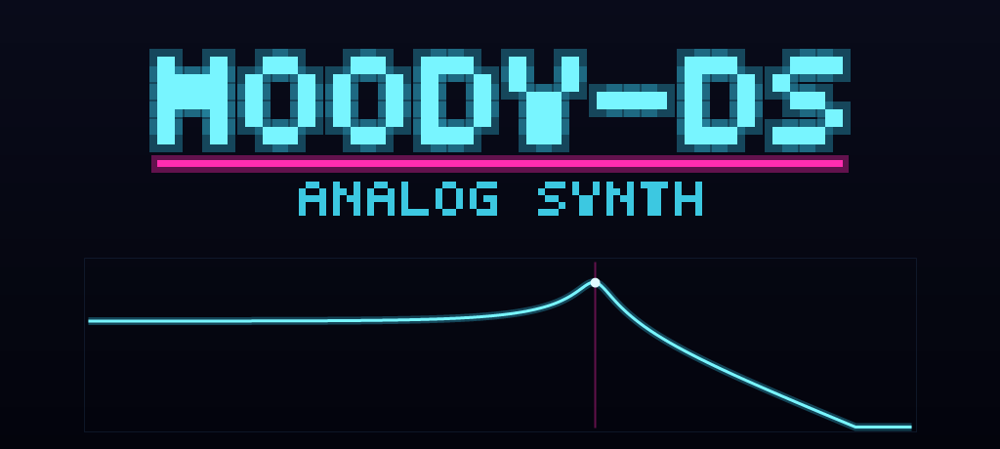

# moody-ds

A touchscreen analog style synth and groovebox for the Nintendo DS.

by HobbyChop Full version available at (https://hobbychop.com)

Turn your Nintendo DS into a pocket synthesizer. Sculpt sounds with your finger on the filter pad, build basslines and beats on the step sequencer, chain them into a full song, and sync it all to your gear. moody-ds is made to be picked up and played.

## The sound

moody-ds is a virtual analog synth. It has the warm, hands on character of a classic subtractive synthesizer, oscillators running into a filter into an envelope, shaped with an LFO and a touch of effects, recreated in software on your DS. There is no analog circuitry inside a DS, so think of "analog" here as the sound and the feel rather than the wiring. If you love that fat, filtered, knob twiddling vibe, you will feel right at home.

## What you can do

**Play**

* A touch keyboard right on the screen, so you can perform by hand.
* A two voice analog part, so a pair of notes can ring out together, played by hand or stacked up by the sequencer and arpeggiator.
* An octave up and down switch, a spring back pitch wheel, and a mod wheel for vibrato right on the keyboard strip.
* A general MIDI drum kit that plays from the drum channel, with its own master drum level.

**Shape**

* A filter pad you sweep with your finger for instant movement and squelch. Slide across for cutoff, up and down for resonance.
* Five filter flavors to pick from: low pass, high pass, band pass, notch, and off.
* Two oscillators per note plus a sub oscillator an octave down, switchable between saw and pulse, with detune, pulse width, and a dash of noise for grit.
* Two envelopes: one for how the note swells and fades, and a second one just for the filter, with its own amount and key tracking.
* An LFO you can send to cutoff, pitch, and pulse width, with rate and depth to taste.
* Glide between notes and velocity that responds to how hard you play.
* Onboard delay and chorus for space and width.

**Sequence**

* A 16 step sequencer with adjustable length and swing for groove.
* Each step can be a note, a glide that slides into the next pitch, a hold that sustains the note across the step, or a rest. Tap a step to cycle through them.
* Notes go in by picking a step and playing the keyboard, with the pitch drawn as a bar in each step.
* An arpeggiator that turns your held notes into rolling patterns, low to high, in time with the sequencer.
* Eight patterns to switch between, each with its own length and notes.
* A song mode that chains your patterns into a full arrangement.
* A one tap clear for the current pattern.

**Save**

* 16 preset slots, each a snapshot of your whole sound and your whole song, every pattern, the chain, the tempo, and the swing.
* Name your presets so you can find them again.
* A separate bank for saving and loading single patterns you want to keep.
* Save, load, and clear each slot yourself, with an ok or cancel to be safe.

**Sync**

* Play moody-ds from any MIDI keyboard, controller, or computer, on the channel you choose.
* Echo incoming MIDI back out, or let the sequencer drive your other gear.
* Lock the sequencer and song to your DAW or hardware clock at normal, half, or double time, so everything stays in step.
* Or let moody-ds lead and send clock to the rest of your setup.
* Twist the screen controls from your MIDI knobs, and watch them move on screen.
* Works great with a DAW, and with an arduinoboy or LSDJ rig.

## Free demo and full version

The free demo is the complete sound engine, the effects, the sequencer, song mode, and the touch keyboard, so you can sit down and make music with it right away.

The full version adds the things you keep and connect:

* Saving and loading your presets and your patterns, whenever you want to.
* MIDI, so you can play from outside gear and sync clock in or out.

Get the full version at hobbychop.com.

## What you need

* A Nintendo DS or DS Lite with a flashcart, to run the game from an SD card.
* An SD card, if you want to save your presets and patterns (full version). With no card the banks still work for your current session.
* For MIDI, the mDS cartridge that plugs into the second cart slot. Because it uses that slot, MIDI works on the original DS and DS Lite. The DSi and 3DS do not have the slot, but the synth, sequencer, and song mode still play on any DS that can run the game.

## Getting started

1. Copy the game file onto your flashcart and launch it.
2. To use MIDI (full version), before booting put the mDS cartridge in the second slot, and plug in your MIDI.
3. Tap the tabs along the top to move between pages. Drag the pad and sliders to shape your sound, and tap the keyboard to play.

## The pages

Tap the tabs across the top of the touch screen:

* FILT: the filter pad you sweep with your finger.
* ENV: how each note swells and fades.
* MOD: the LFO, the filter envelope, and movement.
* OSC: the raw oscillator tone.
* SEQ: the 16 step sequencer.
* SONG: chain your patterns into a song.
* PAT: your bank of saved patterns.
* PRE: your saved presets.
* FX: delay and chorus.
* SET: MIDI channel, thru, clock in and out, sync ratio, and drum level.

## A note on MIDI sync

Turn on Clock In to follow an external clock. moody-ds starts right on the beat and stops cleanly when the clock stops, and you can run it at normal, half, or double time. Turn on Clock Out to lead instead, sending clock and transport to the rest of your rig.

## Credits and license

moody-ds is a HobbyChop release, grown from the sDS synth project. The free demo is fine to share. Please do not redistribute the full version. The names moody-ds, sDS, and mDS belong to the author.

Make all the music you want with moody-ds and release it freely. For commercial or licensing questions, get in touch at hobbychop.com.
